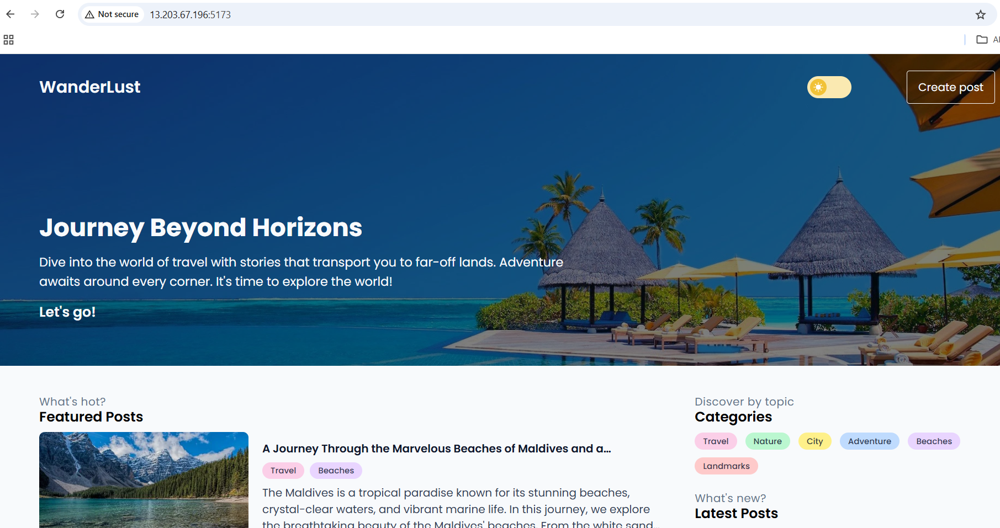
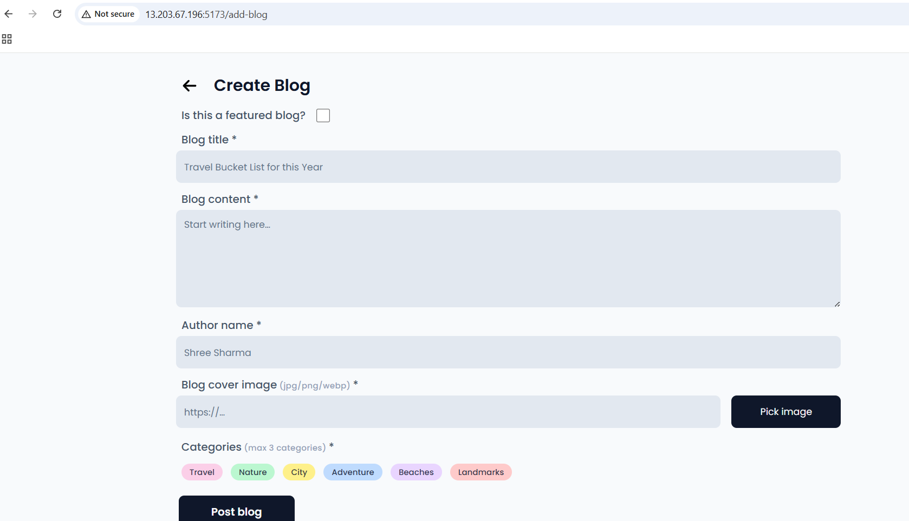

# 🌍 Wanderlust – Travel Blogging Platform

Wanderlust is a travel blogging web application that allows users to document, share, and explore travel experiences from around the world. Whether you're a solo traveler, a group adventurer, or just someone who loves to explore from the screen, Wanderlust makes it easy to share your journey and get inspired by others.



---
## ✨ Features

- 🧳 Create, edit, and publish travel blogs
- 🌐 Explore travel stories by location or tags
- 📸 Upload travel photos and embed them in your posts

## 🚀 Getting Started

### Prerequisites

- Node.js and npm
- MongoDB installed

## Setting up the project locally

1. **Fork and Clone the Repository**

   ```bash
   git clone https://github.com/{your-username}/wanderlust.git
   ```

2. **Navigate to the Backend Directory**

   ```bash
   cd backend
   ```

3. **Install Required Dependencies**

   ```bash
   npm i
   ```

4. **Set up your MongoDB Database**

   - Open MongoDB Compass and connect MongoDB locally at `mongodb://localhost:27017`.

5. **Import sample data**

   > To populate the database with sample posts, you can copy the content from the `backend/data/sample_posts.json` file and insert it as a document in the `wanderlust/posts` collection in your local MongoDB database using either MongoDB Compass or `mongoimport`.

   ```bash
   mongoimport --db wanderlust --collection posts --file ./data/sample_posts.json --jsonArray
   ```

6. **Configure Environment Variables**

   ```bash
   cp .env.sample .env
   ```

7. **Start the Backend Server**

   ```bash
   npm start
   ```

   > You should see the following on your terminal output on successful setup.
   >
   > ```bash
   > [BACKEND] Server is running on port 5000
   > [BACKEND] Database connected: mongodb://127.0.0.1/wanderlust
   > ```

### Setting up the Frontend

1. **Open a New Terminal**

   ```bash
   cd frontend
   ```

2. **Install Dependencies**

   ```bash
   npm i
   ```

3. **Configure Environment Variables**

   ```bash
   cp .env.sample .env.local
   ```

4. **Launch the Development Server**

   ```bash
   npm run dev -- --host  #(use --host to specify the network address of a host machine)
   ```

### Setting up with Docker

1.  **Ensure Docker and Docker Compose are Installed**
    
2.  **Clone the Repository**
    
    ``` bash
    git clone https://github.com/{your-username}/wanderlust.git
    ``` 
3.  **Navigate to the Project Directory**
    
    ```bash
    
    cd wanderlust
    
    ```
4.  **Update Environment Variables**  - If you anticipate the IP address of the instance might change, update the `.env.sample` file with the new IP address.
   
5.  **Environment Variables**
    
    > Update the .env file in both the frontend and backend directory and add:
    
   
    **Backend - .env.sample**
    ```ini
    MONGODB_URI="mongodb://mongo/wanderlust"
    REDIS_URL="redis:6379"
    CORS_ORIGIN="http://13.233.126.24:5173"  #add ip address of ec2 instance on which app is running"
    
    ```
    **Frontend - .env.sample**
    ```ini
    VITE_API_PATH="http://13.233.126.24:5000"  #add ip add of ec2 instance on which app is running
    ```


7.  **Run Docker Compose**
    
    ```bash
    
    docker-compose up -d
    ```
    This command will build the Docker images and start the containers for the backend and frontend in detachable mode, enabling you to access the Wanderlust application.
    
8.  **Import sample data**

    ```bash
    docker exec -it mongo mongoimport --db wanderlust --collection posts --file ./data/sample_posts.json --jsonArray
    ```
    This command will add sample data to your application.  

# 📸 Screenshots


========================================================================================================================================================================================




# 🙋‍♀️ Acknowledgements
Thanks to all the open-source libraries and APIs that made this project possible.


🚀 Feel free to get in touch with me for any further queries or support, happy to help :)
